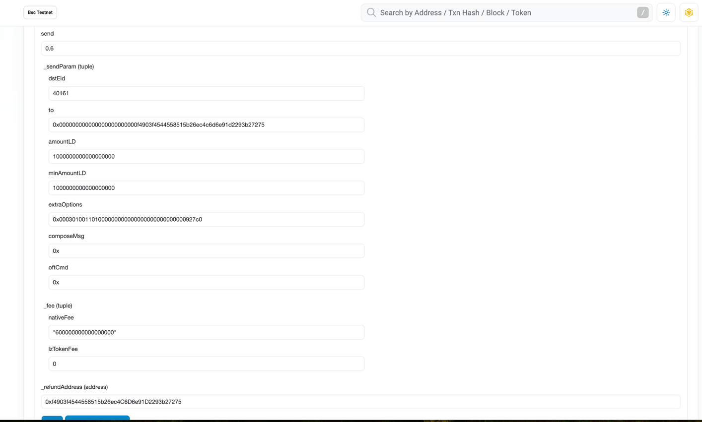
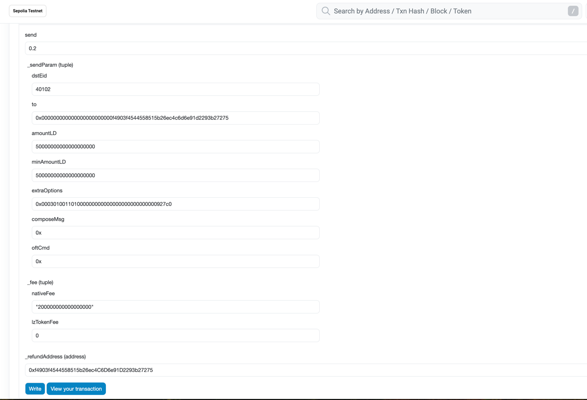

### 安装依赖

```shell
pnpm install
```

### mac 安装 forge

```shell
npm install -g @forge/cli
foundryup
```

### 编译

```shell
pnpm compile
```

If you prefer one over the other, you can use the tooling-specific commands:

```bash
pnpm compile:forge
```

```bash
pnpm compile:hardhat
```

#### Running tests

Similarly to the contract compilation, we support both `hardhat` and `forge` tests. By default, the `test` command will
execute both:

```bash
pnpm test
```

If you prefer one over the other, you can use the tooling-specific commands:

```bash
pnpm test:forge
pnpm test:hardhat
```

## Deploying Contracts

Set up deployer wallet/account:

- Rename `.env.example` -> `.env`
- Choose your preferred means of setting up your deployer wallet/account:

```
MNEMONIC="test test test test test test test test test test test junk"
or...
PRIVATE_KEY="0xabc...def"
```

### 生成abi：

npx hardhat 尝试使用全局安装的 Hardhat，但 Hardhat 需要在本地项目中安装才能正常工作

```shell
pnpm install --save-dev hardhat
npx hardhat export-abi
```

# 时间锁合约

```shell
npx hardhat deploy --network bscTestnet --tags Timelock
```

### 代理合约和逻辑合约部署[WithdrawVault]

```shell
npx hardhat deploy --network bscTestnet --tags WithdrawVault
```

### 代理合约和逻辑主合约部署[Earn]

```shell
npx hardhat deploy --network bscTestnet --tags Earn
```

# 验证合约

```shell
npx hardhat deploy --network bscTestnet --tags TimelockVerify
```

```shell
npx hardhat deploy --network bscTestnet --tags WithdrawVaultVerify
```

```shell
npx hardhat deploy --network bscTestnet --tags EarnVerify
```

# 合约升级

```shell
hardhat deploy --network bscTestnet --tags WithdrawVaultImplementation
```

```shell
hardhat deploy --network bscTestnet --tags EarnImplementation
```

# AssXXX 部署

```shell
npx hardhat deploy --network bscTestnet-BTC --tags AssBTC
```

```shell
npx hardhat deploy --network bscTestnet-BNB --tags AssBNB
```

```shell
npx hardhat deploy --network bscTestnet-USDT --tags AssUSDT
```

```shell
npx hardhat deploy --network bscTestnet-USDC --tags AssUSDC
```

# 部署测试asset BTC BNB USDT USDC

```shell
hardhat deploy --network bscTestnet-BNB --tags BNBTest
```

```shell
hardhat deploy --network bscTestnet-BTC --tags BTCTest
```

```shell
hardhat deploy --network bscTestnet-USDT --tags USDTTest
```

```shell
hardhat deploy --network bscTestnet-USDC --tags USDCTest
```

# 测试合约升级

```shell
npx hardhat upgrade:WithdrawVault --network bscTestnet
```

```shell
npx hardhat upgrade:Earn --network bscTestnet
```

# 分配权限

## AssXXX 合约

grantRole: 把 Earn合约地址加到 MINTER_AND_BURN_ROLE 角色下
approve: 授权spender(Earn合约地址)使用多少数量的token

## XXX 合约

approve: 授权spender(Earn合约地址)使用多少数量的token

## Earn

grantRole: 把 bot(后端发起交易地址)地址加到 BOT_ROLE 角色下

## WithdrawVault 合约

grantRole: 把 Earn合约地址加到 TRANSFER_ROLE 角色下

# 测试操作流程

## 1. 授权

[Earn 合约] grantRole: 把 bot(后端发起交易地址)地址加到 BOT_ROLE 角色下

[WithdrawVault 合约]  grantRole: 把 Earn合约地址加到 TRANSFER_ROLE 角色下

## 2.[AssXXX 合约] 部署AssXXX合约

### 2.1 grantRole: 把 Earn合约地址加到 MINTER_AND_BURN_ROLE 角色下

### 2.2 approve: 授权spender(Earn合约地址)使用多少数量的token

## 3.addToken

## 4. deposit 或者  depositNative

## 5. transferToCeffu

## 6. uploadExchangeRate

### 例子

[{"assTokenAddress":"0x3f41a2d00D9D294B4097B68EbFBE7dfE955fc3Cc","assToSourceExchangeRate":"100000000","exchangeRateExpiredTimestamp":"1735660800"}]

## 7. requestWithdraw

## 8. 向Ceffu提现

## 9. distributeWithdraw

### 例子

[{"assTokenAddress":"0x3f41a2d00D9D294B4097B68EbFBE7dfE955fc3Cc","sourceTokenAmount":"100000000000000000","requestWithdrawNo":1,"receipt":"0xf4903f4544558515b26ec4C6D6e91D2293b27275"}]

[{"assTokenAddress":"0xbb8f7E2321c4a7D8b9B432792103A5d48A74ace8","sourceTokenAmount":"10000000000000000","requestWithdrawNo":2,"receipt":"0xf4903f4544558515b26ec4C6D6e91D2293b27275"}]

## 10. claimWithdraw

# oft 跨链相关步骤

跨链部署文档 https://docs.layerzero.network/v2/developers/evm/create-lz-oapp/start
查看交易 https://testnet.layerzeroscan.com/address/0xf4903f4544558515b26ec4c6d6e91d2293b27275
链上跟踪交易  https://dashboard.tenderly.co/tx/bnb-testnet/0xeb394f04f8a578d1bbecbdee25093f98bff892c9289cf7d064a37ab04d36c1cb

```shell
npx hardhat deploy --network bscTestnet-USDC --tags AssUSDC
```

```shell
npx hardhat deploy --network sepoliaTestnet-USDC --tags AssUSDC
```

```shell
npx hardhat deploy --network bscTestnet-USDC --tags AssUSDCVerify
```

```shell
npx hardhat deploy --network sepoliaTestnet-USDC --tags AssUSDCVerify
```

```shell
npx hardhat lz:oapp:config:init --contract-name AssXXX --oapp-config testnet.layerzero.config.ts
```

```shell
npx hardhat lz:oapp:wire --oapp-config testnet.layerzero.config.ts
```

# bscTestnet-USDC AssUSDC

## 设置setTransferLimitConfigs

[{"dstEid":40161,"maxDailyTransferAmount":"1000000000000000000000000000","singleTransferUpperLimit":"10000000000000000000000000","singleTransferLowerLimit":"0","dailyTransferAmountPerAddress":"100000000000000000000000000","dailyTransferAttemptPerAddress":"10000000"}]


## send 发起交易



# sepoliaTestnet-USDC AssUSDC

## 设置setTransferLimitConfigs

[{"dstEid":40102,"maxDailyTransferAmount":"1000000000000000000000000000","singleTransferUpperLimit":"10000000000000000000000000","singleTransferLowerLimit":"0","dailyTransferAmountPerAddress":"100000000000000000000000000","dailyTransferAttemptPerAddress":"10000000"}]

## send 发起交易




## send 发起交易注意事项

### send要于nativeFee价值上保持一致，注意单位。自行调整数值
### amountLD 于minAmountLD 保持一致
### to
``` js
    const toBytes32Value = arrayToBytes32(ethers.utils.zeroPad('0xf4903f4544558515b26ec4C6D6e91D2293b27275', 32));
    console.log(toBytes32Value);
```
### extraOptions
``` js
    const extraOptions = Options.newOptions().addExecutorLzReceiveOption(600000, 0).toHex().toString()
    console.log(extraOptions)
```
### composeMsg 0x
### oftCmd 0x
### lzTokenFee 0
### _refundAddress 先多扣native fee，后面通过这个退款地址，返回给发起方
